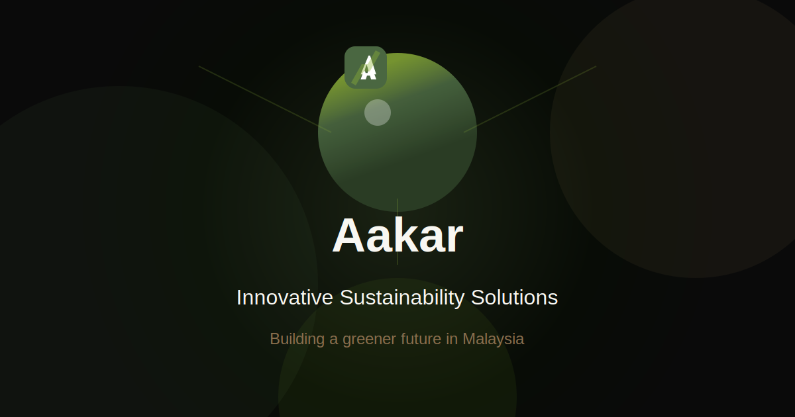

# Aakar - Sustainable Technology Solutions

A modern, eco-friendly landing page for Aakar, a greentech company focused on building software, data, and AI solutions that directly contribute to sustainability projects in Malaysia.



## Features

- Immersive 3D animated hero section built with Three.js
- Modern, responsive design with Tailwind CSS
- Built on Next.js for performance and SEO optimization
- Earthy color palette reflecting the sustainability focus
- Smooth animations and transitions

## Tech Stack

- **Frontend**: Next.js 14 with App Router, TypeScript, Tailwind CSS
- **3D Rendering**: Three.js with React Three Fiber and React Three Drei
- **Animations**: GSAP for smooth transitions

## Getting Started

### Prerequisites

- Node.js 18.17 or later
- npm or yarn

### Installation

1. Clone the repository:

```bash
git clone https://github.com/yourusername/aakar.git
cd aakar
```

2. Install dependencies:

```bash
npm install
# or
yarn install
```

3. Run the development server:

```bash
npm run dev
# or
yarn dev
```

4. Open [http://localhost:3000](http://localhost:3000) in your browser to see the result.

## Project Structure

```
aakar/
├── public/                # Static files
│   ├── favicon.svg        # Favicon
│   └── og-image.svg       # Open Graph image for social sharing
├── src/
│   ├── app/               # Next.js App Router
│   │   ├── globals.css    # Global styles with Tailwind
│   │   ├── layout.tsx     # Root layout with fonts and metadata
│   │   └── page.tsx       # Landing page component
│   └── components/        # React components
│       └── HeroAnimation.tsx  # Three.js animated hero
├── .gitignore
├── next.config.js
├── package.json
├── postcss.config.js
├── README.md
├── tailwind.config.js
└── tsconfig.json
```

## Customization

### Colors

The color scheme can be customized in `src/app/globals.css`:

- `--background`: Light beige background
- `--foreground`: Deep forest green text
- `--primary`: Sage green primary color
- `--secondary`: Warm brown secondary color
- `--accent`: Olive green accent
- `--light-accent`: Light sage highlight

### 3D Animation

The 3D animation in the hero section can be customized in `src/components/HeroAnimation.tsx`.

## Deployment

This project can be easily deployed to Vercel:

[](https://vercel.com/new/clone?repository-url=https%3A%2F%2Fgithub.com%2Fyourusername%2Faakar)

## License

This project is licensed under the MIT License - see the LICENSE file for details.

## Acknowledgements

- [Next.js](https://nextjs.org/) - The React Framework for the Web
- [Three.js](https://threejs.org/) - JavaScript 3D library
- [React Three Fiber](https://docs.pmnd.rs/react-three-fiber) - React renderer for Three.js
- [Tailwind CSS](https://tailwindcss.com/) - Utility-first CSS framework
- [GSAP](https://greensock.com/gsap/) - Professional-grade animation library
